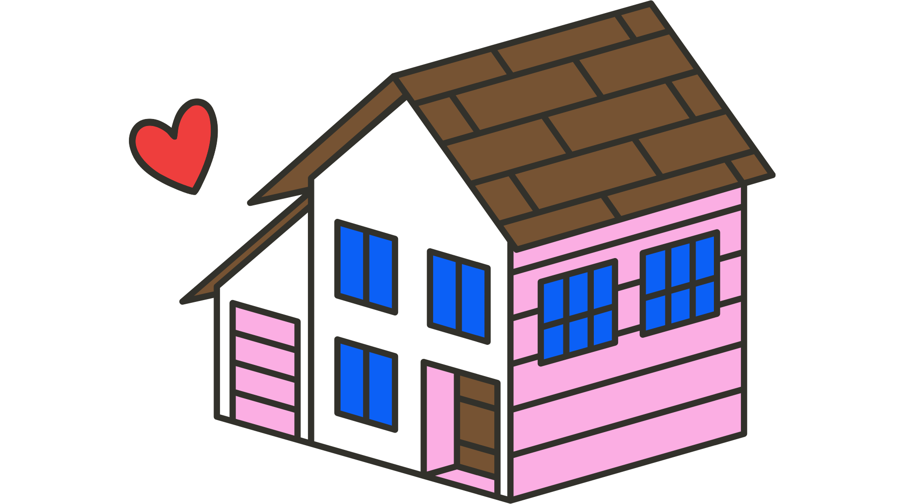

<a id="readme-top"></a>

<br>

<!-- table of contents -->
<details>
  <summary>Table of Contents</summary>
  <ol>
    <li><a href="#installation">Installation</a></li>
    <li><a href="#running">Running</a></li>
  </ol>
</details>

<br>

<hr>

<br>

<a id="installation"></a>


_A room‑rental marketplace built for all internationals in Singapore._

Built by **Team 1** for the IS622 Digital Product Management course, *homie!* makes it easy to list a room, browse available properties, and manage saved listings through a clean, mobile‑friendly interface.

## 🧩 Features

- Browse property listings with images and pricing
- User profile page with editable picture, username, email, and password
- Responsive layout built with Vue, Bootstrap and custom CSS
- Smooth animations via Slick carousel and AOS

## 🛠 Tech Stack

- HTML, CSS, JavaScript (vanilla + Bootstrap)
- jQuery for DOM manipulation and plugins
- SweetAlert2 for user notifications
- Slick carousel for listing slideshows
- AOS (Animate on Scroll) for entrance effects
- Static site; no backend – data stored in `localStorage`

## 📁 Installation & Development

1. **Clone the repository**
   ```sh
   gh repo clone meldagoh/is622-homie
   cd is622-homie
   ```
2. **Open in VS Code**
   - Download/install [Visual Studio Code](https://code.visualstudio.com/download) if needed.
   - (Optional) use [GitHub Desktop](https://desktop.github.com/) for GUI git operations.
3. **Run a local server**
   - Install the `Live Server` extension (`ritwickdey.LiveServer`).
   - Right‑click any `.html` file (e.g. `landing.html` or `home.html`) and choose **Open with Live Server**.

> The site is entirely client‑side; no build process is required.

## 🧑‍💻 Usage

- Navigate between pages via the top navigation component.
- Click **Explore** on the landing page to view listings.
- Use the profile page to view or edit your details. Changes persist in your browser's storage.

## 📝 Notes for Contributors

- HTML files are located in the root and subfolders (e.g., `/profile`, `/propertyListings`).
- CSS is split between `home.css` and page‑specific styles like `profile/profile.css`.
- `profile/profile.js` contains the JavaScript logic for the profile page.

### Adding a New Page
1. Create a new `.html` file and add it to the navigation component if necessary.
2. Add any new styles to an existing CSS file or create a new one and link it in the HTML head.
3. Write JavaScript for interactivity; include scripts at the bottom of the HTML or in separate `.js` files.

## 📬 Questions or Feedback

Contact the project maintainers or refer to the course materials for guidance.



<p align="right">(<a href="#readme-top">back to top</a>)</p>

<br><br>